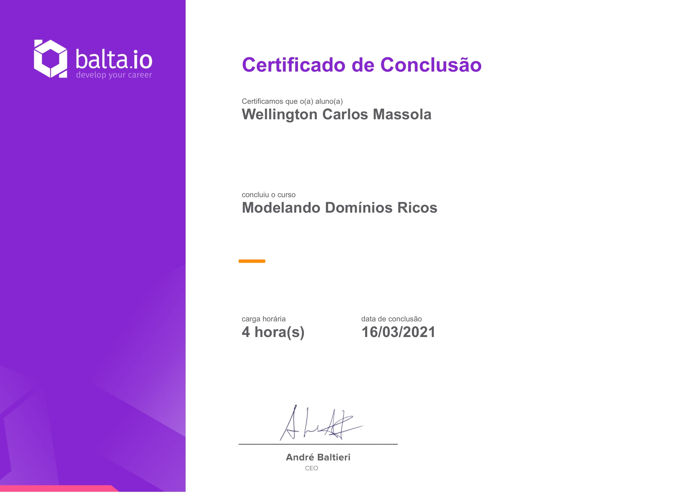

# Curso [balta.io 1975](https://balta.io/cursos/modelando-dominios-ricos)

Curso Backend C#.  

Link do curso: [https://balta.io/cursos/modelando-dominios-ricos](https://balta.io/cursos/modelando-dominios-ricos)

Tecnologias:  

## Modelando Domínios Ricos

Criar um contexto de pagamento utilizando recursos de OOP, DDD e CQRS.

## Instrutor

André Baltieri - 8x Microsoft MVP

## Progresso do curso

- [x] Introdução
- [x] Linguagem Ubíqua
- [x] Domínios Ricos vs Domínios Anêmicos
- [x] Sub Domínios
- [x] Separação em Contextos Delimitados
- [x] Organizando a Solução
- [x] Definindo as Entidades
- [x] Corrupção no Código
- [x] SOLID e Clean Code
- [x] Primitive Obsession
- [x] Value Objects
- [x] Implementando Validações
- [x] Design By Contracts
- [x] Testando as Entidades e VOs
- [x] Commands
- [x] Fail Fast Validations
- [x] Testando os Commands
- [x] Repository Pattern
- [x] Handlers
- [x] Testando os Handlers
- [x] Queries
- [x] Testando suas Queries

